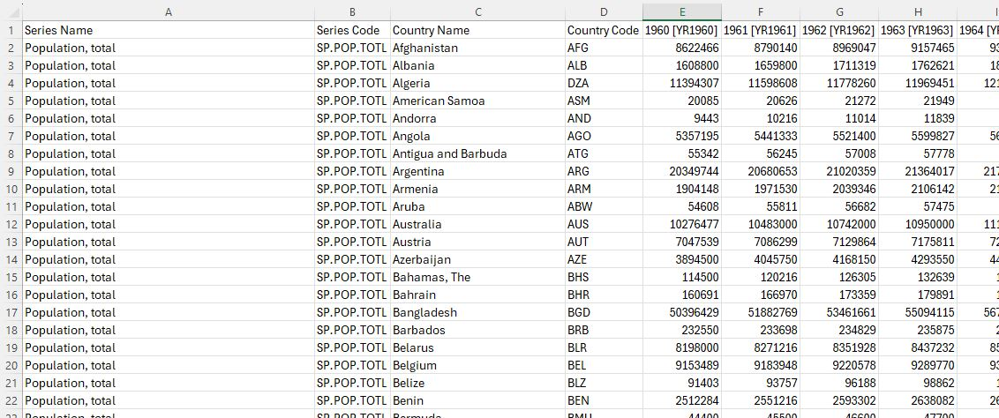
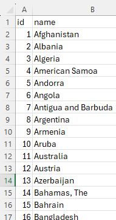
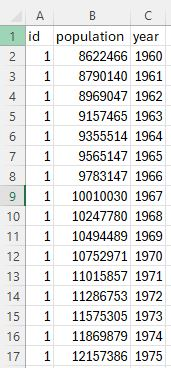
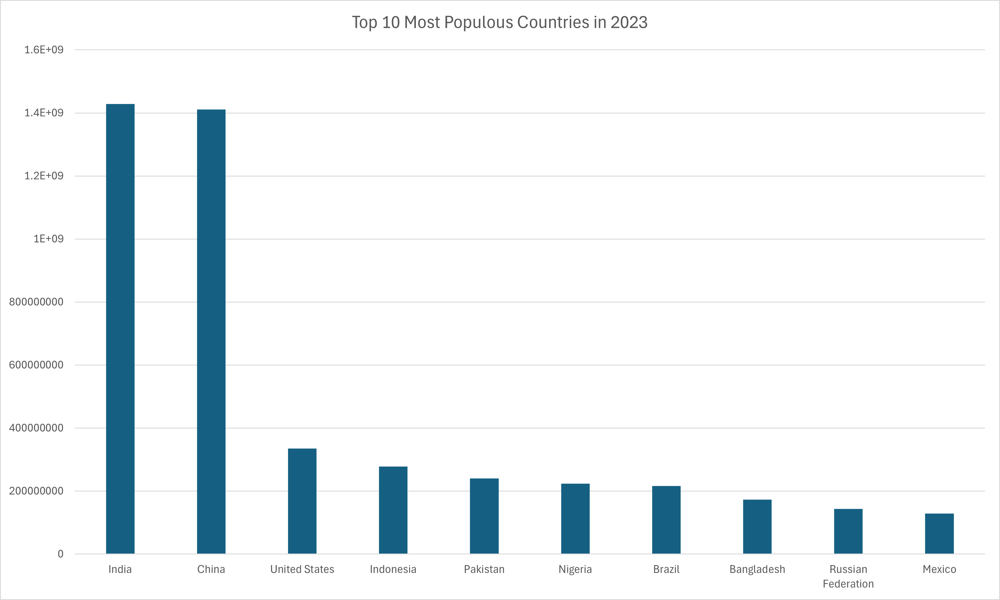
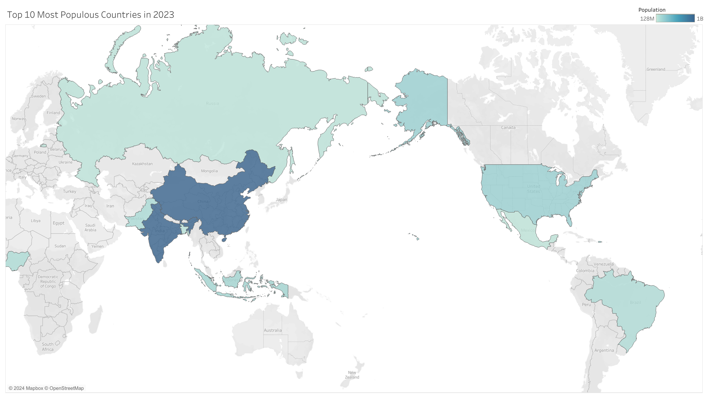
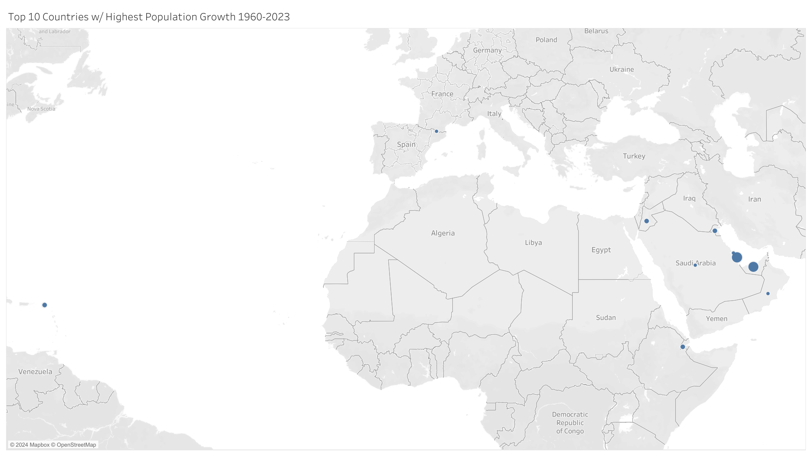

# Introduction
**This project examines the total population of 217 countries & territories around the world from 1960 to 2023 🌎**

Shortcut to all the SQL queries used:
[project folder](/project/)

Data source: https://databank.worldbank.org/ <br>
Database: World Development Indicators <br>
Last Updated: 06/28/2024 <br>
License URL: https://datacatalog.worldbank.org/public-licenses#cc-by <br>
License type: CC BY-4.0	 <br>
*Note: Total population is based on the de facto definition of population, which counts all residents regardless of legal status or citizenship. The values shown are midyear estimates.*

# Background
As an aspiring data analyst, I wanted to create a project to further develop my skills, specifically with SQL and Excel. I chose to dive into this world population data simply because I find it interesting.

### The questions I wanted to answer through my SQL queries were:

1. What were the Top 10 Most Populous Countries in 1960?
2. What were the Top 10 Most Populous Countries in 2023?
3. Which countries had the highest population in 1960 as well as 2023?
4. What was the population growth percentage from 1960 to 2023 for each country?
5. What are the Top 10 Countries with the Highest Population Growth between 1960 and 2023?
6. Are there any countries that have seen a decline in population since 1960?

# Tools I Used
- **SQL:** Used to query the database and uncover insights.
- **Microsoft Excel:** Used to examine, clean, and manipulate the dataset in preparation for analysis.
- **PostgreSQL:** Database management system used to handle the population data.
- **Visual Studio Code:** Code editor of choice for executing SQL queries.
- **Git & GitHub:** Used for version control and sharing my project.

# The Analysis
I downloaded the population/year data from the World Bank Group website and opened it in Excel. The first thing I noticed is that I would need to clean and manipulate the table to prepare it for analysis.


*This is just a snippet of the dataset*

I decided to create two tables from the dataset: The first table is called "countries.csv" and contains an "id" column (INT, PRIMARY KEY) and a "name" column (TEXT). The second table is "population_year.csv" and also contains an "id" column (INT, FOREIGN KEY), "population" column (INT), and a "year" column (INT). Once that was completed, the data was prepared for analysis.

 &nbsp;
 <br>
*This is a snippet of the 218 row countries.csv dataset and the 13,889 row population_year.csv dataset*

For this project, each query was designed to explore a specific question about the population data. Here's the approach I took for each question:

### 1. Top 10 Most Populous Countries in 1960

```sql
SELECT
    name,
    population
FROM
    countries
LEFT JOIN population_year
    ON countries.id = population_year.id
WHERE
    year = '1960'
ORDER BY
    population DESC
LIMIT 10;
```

| Name                | Population   |
|---------------------|--------------|
| China               | 667,070,000  |
| India               | 445,954,579  |
| United States       | 180,671,000  |
| Russian Federation  | 119,897,000  |
| Japan               | 93,216,000   |
| Indonesia           | 88,382,881   |
| Brazil              | 73,092,515   |
| Germany             | 72,814,900   |
| United Kingdom      | 52,400,000   |
| Bangladesh          | 50,396,429   |

### 2. Top 10 Most Populous Countries in 2023

```sql
SELECT
    name,
    population
FROM
    countries
LEFT JOIN population_year
    ON countries.id = population_year.id
WHERE
    year = '2023'
ORDER BY
    population DESC
LIMIT 10;
```



*Bar chart shows the staggering difference between India's population and the United States'*




### 3. Countries with the Highest Population in 1960 AND 2023

```sql
(
    SELECT name AS country
    FROM countries
    LEFT JOIN population_year
        ON countries.id = population_year.id
    WHERE year = '1960'
    ORDER BY population DESC
    LIMIT 10
)
INTERSECT
(
    SELECT name AS country
    FROM countries
    LEFT JOIN population_year
        ON countries.id = population_year.id
    WHERE year = '2023'
    ORDER BY population DESC
    LIMIT 10
);
```

| Country             |
|---------------------|
| United States       |
| Russian Federation  |
| Brazil              |
| Bangladesh          |
| Indonesia           |
| China               |
| India               |

*Table in no particular order*

### 4. Population Growth Percentage of Each Country from 1960 to 2023

This particular query was a bit complicated for a couple of reasons.

1. 'West Bank and Gaza' has no population data until 1990 (the cells before then contain a '0'). I could've removed that data from the tables before analysis, or even used a certain where clause in this query, but thought I'd give myself more a challenge with this query 😉 It also meant that I had to filter for "population_growth_percentage IS NOT NULL" so West Bank and Gaza didn't appear in the results table.
2. In order to calculate the population growth percentage correctly, I had to cast the populations as float instead of integer.

```sql
WITH pop_growth AS (
SELECT 
    c.name,
    CASE
        WHEN p1960.population <> '0'
        THEN ((CAST(p2023.population AS FLOAT) - CAST(p1960.population AS FLOAT)) / p1960.population) * 100 
        ELSE NULL
    END AS population_growth_percentage
FROM 
    countries AS c
LEFT JOIN 
    population_year AS p2023 ON c.id = p2023.id AND p2023.year = '2023'
LEFT JOIN 
    population_year AS p1960 ON c.id = p1960.id AND p1960.year = '1960'
ORDER BY
    population_growth_percentage DESC
)

SELECT 
    name AS country,
    ROUND(CAST(population_growth_percentage AS numeric),0) AS growth_perc
FROM 
    pop_growth
WHERE
    population_growth_percentage IS NOT NULL
```

| **country**                      | **growth_perc** |
|----------------------------------|------------------|
| Qatar                            | 7366             |
| United Arab Emirates             | 7033             |
| Sint Maarten (Dutch part)        | 1456             |
| Kuwait                           | 1311             |
| Jordan                           | 1237             |
| Djibouti                         | 1222             |
| Bahrain                          | 824              |
| Saudi Arabia                     | 787              |
| Oman                             | 766              |
| Andorra                          | 748              |
| Turks and Caicos Islands         | 722              |
| Cayman Islands                   | 718              |
| Cote d'Ivoire                    | 679              |
| Niger                            | 678              |
| St. Martin (French part)         | 676              |
| Kenya                            | 611              |
| Gambia, The                      | 594              |
| Angola                           | 585              |
| Tanzania                         | 572              |
| Congo, Dem. Rep.                 | 569              |
| Zambia                           | 559              |

*This is only a snippet of the results*

### 5. Top 10 Countries with Highest Population Growth between 1960 and 2023

```sql
WITH pop_growth AS (
SELECT 
    c.name,
    ((CAST(p2023.population AS FLOAT) - CAST(p1960.population AS FLOAT)) / p1960.population) * 100 AS population_growth_percentage
FROM 
    countries AS c
LEFT JOIN 
    population_year AS p2023 ON c.id = p2023.id AND p2023.year = '2023'
LEFT JOIN 
    population_year AS p1960 ON c.id = p1960.id AND p1960.year = '1960'
ORDER BY
    population_growth_percentage DESC
)

SELECT 
    name AS country,
    ROUND(CAST(population_growth_percentage AS numeric),0) AS growth_perc
FROM 
    pop_growth
WHERE
    name <> 'West Bank and Gaza'
LIMIT 10;
```

| **country**                      | **growth_perc** |
|----------------------------------|------------------|
| Qatar                            | 7366             |
| United Arab Emirates             | 7033             |
| Sint Maarten (Dutch part)        | 1456             |
| Kuwait                           | 1311             |
| Jordan                           | 1237             |
| Djibouti                         | 1222             |
| Bahrain                          | 824              |
| Saudi Arabia                     | 787              |
| Oman                             | 766              |
| Andorra                          | 748              |


*Map showing that 8 out of the 10 countries w/ the highest population growth are in the Middle East (Asia)*

### 6. Countries with a Decline in Population Between 1960 and 2023

```sql
WITH pop_growth AS (
SELECT 
    c.name,
    ((CAST(p2023.population AS FLOAT) - CAST(p1960.population AS FLOAT)) / p1960.population) * 100 AS population_growth_percentage
FROM 
    countries AS c
LEFT JOIN 
    population_year AS p2023 ON c.id = p2023.id AND p2023.year = '2023'
LEFT JOIN 
    population_year AS p1960 ON c.id = p1960.id AND p1960.year = '1960'
ORDER BY
    population_growth_percentage DESC
)

SELECT 
    name AS country,
    ROUND(CAST(population_growth_percentage AS numeric),0) AS growth_perc
FROM 
    pop_growth
WHERE
    name <> 'West Bank and Gaza' AND
    population_growth_percentage < 0
```

| country              | growth_perc |
|----------------------|-------------|
| Bosnia and Herzegovina| -2          |
| Hungary               | -4          |
| Croatia               | -7          |
| Latvia                | -11         |
| Ukraine               | -13         |
| St. Kitts and Nevis   | -16         |
| Bulgaria              | -18         |

*Bulgaria is considered the world's fastest-shrinking nation*

# Insights

1. **High Growth Rates**
   - The majority of the countries on the Top 10 Highest Growth Rate list are from the Middle East and show exceptionally high growth percentages. Qatar and the United Arab Emirates lead with astronomical growth rates exceeding 7000%. This can be attributed to the discovery of oil and gas in these regions, leading to rapid economic development and significant population influxes.

   - The economic boom in these countries has attracted many expatriates, driving up population growth. In addition, the rapid urbanization and development of infrastructure have played significant roles in this growth.

2. **Significant Growth in Africa and the Middle East**
   - Many African countries show high growth rates, such as Niger (678%), Kenya (611%), and Angola (585%). This suggests significant population growth due to high birth rates and improving healthcare.
   - Middle Eastern countries like Jordan (1237%), Djibouti (1222%), and Bahrain (824%) also show high growth, driven by economic opportunities and migration.

3. **Moderate Growth Rates**
   - Countries with moderate growth rates include India (220%), Indonesia (214%), and Brazil (196%). These countries have substantial population growth due to a combination of high birth rates and economic development.
   - Mexico (254%) and Bangladesh (243%) also fall into this category, reflecting ongoing demographic changes.

4. **Low to Negative Growth Rates**
   - Serbia (0%), Bosnia and Herzegovina (-2%), and Hungary (-4%) have either stagnating or declining populations. This is often due to low birth rates and high emigration.
   - Countries like Croatia (-7%) and Latvia (-11%) face similar challenges, reflecting broader demographic trends in Eastern Europe and the Baltic states.
    - Bulgaria, with a population growth rate of -18% from 1960 to 2023, is experiencing a significant decline in its population. This negative growth rate reflects a combination of low birth rates, an aging population, and emigration. Many Bulgarians have moved abroad in search of better economic opportunities, which contributes to the country's demographic challenges. The decline in population is indicative of broader trends seen in several Eastern European countries, where similar issues are affecting long-term population stability.

5. **Stable or Minimal Growth**
   - Some countries like Germany (16%), Italy (17%), and Sweden (41%) have relatively stable or minimal growth rates. This is typically due to lower birth rates and higher standards of living that influence demographic changes.